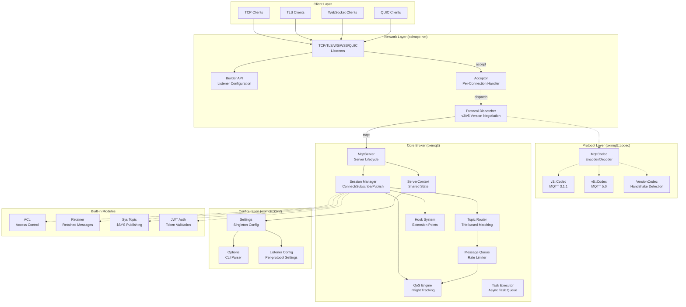
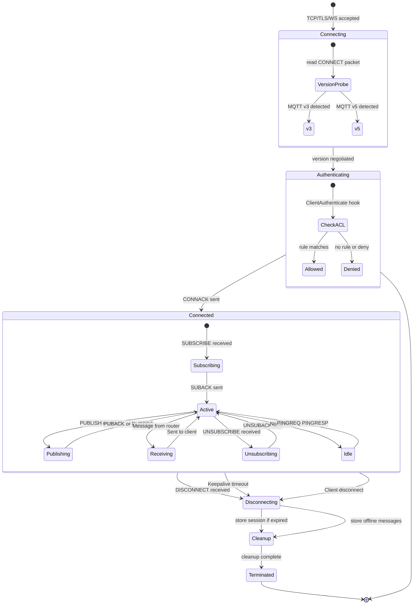
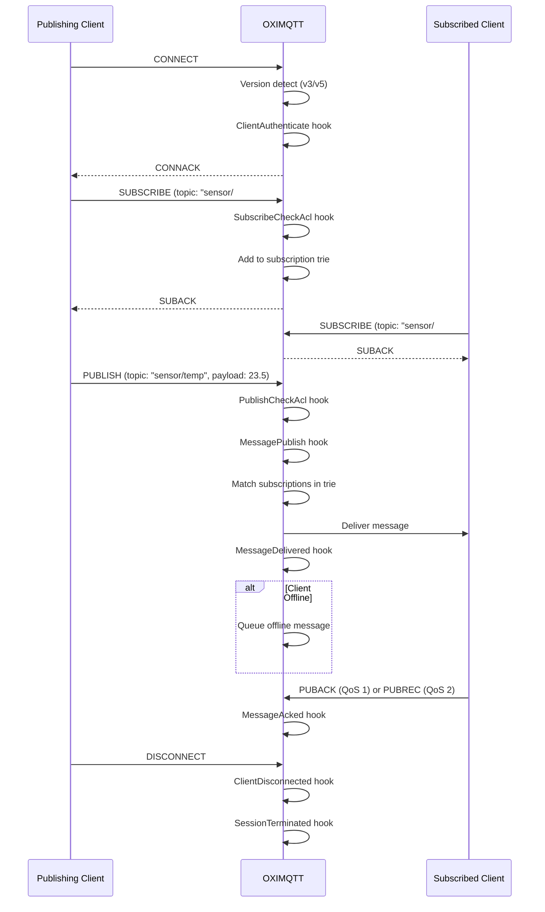
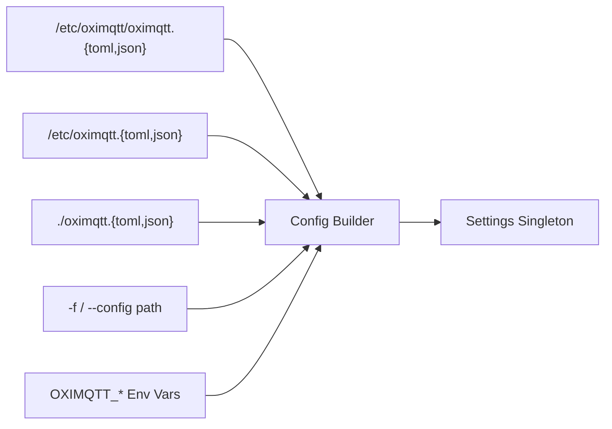

[**English**](overview.md) | [简体中文](../../zh_CN/architecture/overview.md)

# OXIMQTT Architecture Overview

This document describes the internal architecture of the OXIMQTT MQTT broker, its components, module organization, and key design decisions.

---

## System Architecture



---

## Crate Organization

The workspace is organized into these layers:

### Core Library

| Crate | Path | Responsibility |
|-------|------|----------------|
| `oximqtt` | `oximqtt/` | Core MQTT broker: codec (`codec/`), network (`net/`), utilities (`utils/`), configuration (`conf/`), session management, routing, hooks, built-in modules |

### Binaries & Tools

| Crate | Path | Responsibility |
|-------|------|----------------|
| `oximqttd` | `oximqtt-bin/` | Production binary: CLI parsing → config → built-in module registration → server start |
| `mqtt_harness` | `oximqtt-test/` | Test harness: functional, stress, and chaos testing |

### Built-in Modules

The following built-in modules are part of the `oximqtt` core crate. They are configured directly in `oximqtt.toml` under their respective sections:

| Module | Config Section | Responsibility |
|--------|---------------|----------------|
| `acl` | `[acl]` | File-based ACL rule engine |
| `auth_jwt` | `[auth_jwt]` | JWT authentication |
| `retainer` | `[retainer]` | Retained message storage |
| `sys_topic` | `[sys_topic]` | $SYS system topic publishing |

---

## Core Module Architecture (oximqtt/src/)

```
oximqtt/src/
├── lib.rs           # Crate root, re-exports, module declarations
│
├── server.rs        # MqttServer — builder + accept loop + lifecycle
├── context.rs       # ServerContext — shared state builder
├── session.rs       # Session — per-client state machine (~2400 lines)
│
├── v3.rs            # MQTT v3.1.1 protocol handler
├── v5.rs            # MQTT v5.0 protocol handler
│
├── router.rs        # Topic-based message router
├── trie.rs          # Trie structure for subscription matching
├── topic.rs         # Topic filter parsing and validation
├── fitter.rs        # Topic filter matching engine
│
├── inflight.rs      # In-flight message tracking (QoS 1/2)
├── queue.rs         # Message queue with rate limiting
│
├── hook.rs          # Hook system — 23 extension points
├── extend.rs        # Extension point storage (10 RwLock slots)
├── executor.rs      # Async task executor wrapper
│
├── types.rs         # Core data types (~3000 lines)
├── node.rs          # Node identity and busy-state detection
│
├── acl.rs           # ACL types and trait definitions
│
├── args.rs          # Command-line argument struct
│
├── delayed.rs       # Delayed publish
├── metrics.rs       # Metrics collection
├── builtins/        # Built-in modules (acl, auth_jwt, retainer, sys_topic)
├── retain.rs        # Retained messages
├── stats.rs         # Runtime statistics
└── subscribe.rs     # Subscription helpers
```

---

## Session Lifecycle



---

## Hook System

The hook system is the primary extension mechanism. It provides **23 interception points** along the message processing pipeline.

### Hook Trait

```rust
#[async_trait]
pub trait Handler: Send + Sync {
    async fn hook(&self, param: &Type, acc: Option<()>) -> ReturnType;
}
```

### Hook Types

| Hook Type | Trigger | Handler Returns |
|-----------|---------|-----------------|
| `BeforeStartup` | Broker initialization | Continue |
| `ClientConnect` | CONNECT received | `(bool, Option<ConnAckReason>)` |
| `ClientAuthenticate` | Before CONNACK | `(bool, Option<ConnAckReason>)` |
| `ClientConnack` | CONNACK sent | Continue |
| `ClientConnected` | Session established | Continue |
| `ClientDisconnected` | Session ended | Continue |
| `ClientSubscribe` | SUBSCRIBE received | Continue |
| `ClientSubscribeCheckAcl` | Subscribe ACL check | `(bool, Option<SubscribeAclResult>)` |
| `ClientKeepalive` | Keepalive timeout or ping received | Continue |
| `ClientUnsubscribe` | UNSUBSCRIBE received | Continue |
| `MessagePublish` | PUBLISH received | `(bool, Option<MessagePublishResult>)` |
| `MessagePublishCheckAcl` | Publish ACL check | `(bool, Option<PublishAclResult>)` |
| `MessageDelivered` | Message sent to client | Continue |
| `MessageAcked` | Client acknowledged | Continue |
| `MessageDropped` | Message dropped | Continue |
| `MessageExpiryCheck` | Check if message has expired | Continue |
| `MessageNonsubscribed` | No matching subscribers found | Continue |
| `SessionCreated` | Session created | Continue |
| `SessionTerminated` | Session destroyed | Continue |
| `SessionSubscribed` | Subscription added | Continue |
| `SessionUnsubscribed` | Subscription removed | Continue |
| `OfflineMessage` | Offline message stored | Continue |
| `OfflineInflightMessages` | Reconnecting client loads in-flight messages | Continue |

### Hook Registration Priority

Handlers can register with a priority. Lower values execute first.

---

## Built-in Modules

The built-in modules (ACL, JWT auth, retainer, sys_topic) are configured directly in `oximqtt.toml` under their respective sections (`[acl]`, `[auth_jwt]`, `[retainer]`, `[sys_topic]`).

The hook system remains available for extending broker functionality. Built-in modules register their handlers through the same hook system during server initialization.

---

## Message Flow



---

## Configuration Loading Order



Plugin configs are no longer loaded separately. All configuration, including built-in module settings, is managed through `oximqtt.toml` and its associated environment variables.

---

## Feature Flags

The core broker (`oximqtt`) uses Cargo feature flags to conditionally compile transport layers:

| Feature | What it enables | Key Dependencies |
|---------|----------------|------------------|
| `default` | TLS + WebSocket + QUIC transports | — |
| `tls` | TLS transport | `rustls`, `tokio-rustls`, `x509-parser` |
| `ws` | WebSocket transport | `tokio-tungstenite` |
| `quic` | QUIC transport | implies `tls` |

All other functionality (delayed publish, retained messages, metrics, stats, etc.) is compiled unconditionally as built-in modules.

---

## Key Design Decisions

### 1. Zero Unsafe Code

The entire codebase enforces `#![deny(unsafe_code)]`. All concurrency is handled through safe abstractions (`tokio::sync`, `DashMap`, `Arc`).

### 2. Lock Strategy

- **Hot paths**: `DashMap` (lock-free concurrent hash maps) for subscription trie and session lookups
- **Async contexts**: `tokio::sync::RwLock` for config and shared state (never `std::sync::RwLock` in async code)
- **Fine-grained**: `std::sync::Mutex` only for small, synchronous critical sections

### 3. No Panic in Production

- `unwrap()` / `expect()` only in test code
- All `Result` and `Option` are handled via `?` or pattern matching
- No `panic!` / `todo!` / `unreachable!` in production paths

### 4. Built-in Module Isolation

Built-in modules are self-contained and configured directly in `oximqtt.toml`. Each module (ACL, JWT auth, retainer, sys-topic) registers its hook handlers during server initialization.

### 5. Codec Architecture

The MQTT codec uses a state machine pattern:
1. `VersionCodec` detects protocol version from the CONNECT packet
2. Switches to `v3::Codec` or `v5::Codec` for the remainder of the session
3. Both implement `tokio_util::codec::Encoder/Decoder` for async streaming

---

## License

Apache-2.0
