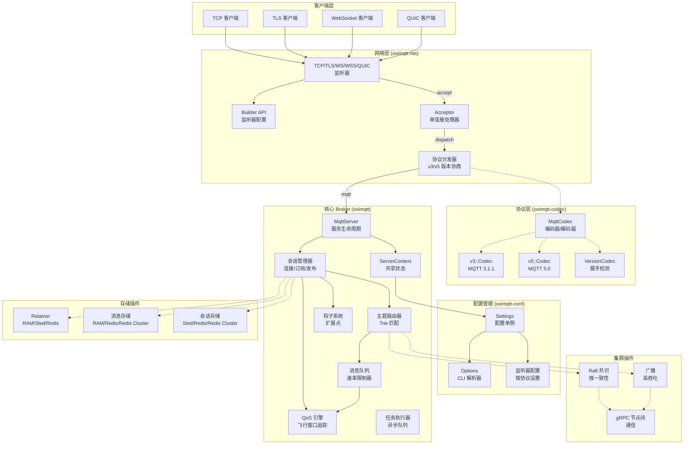
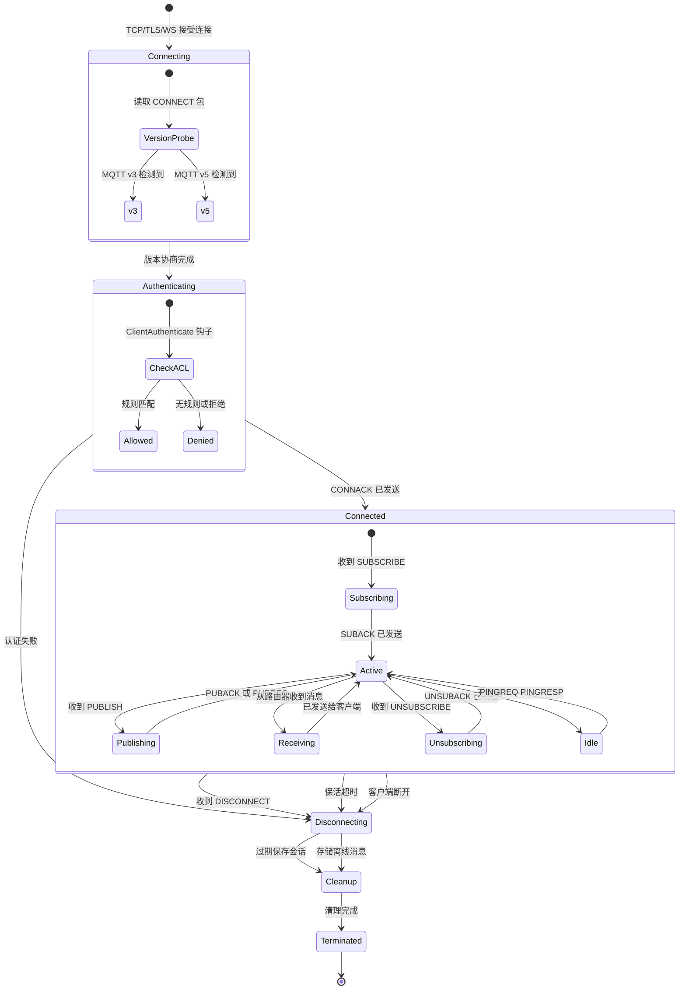
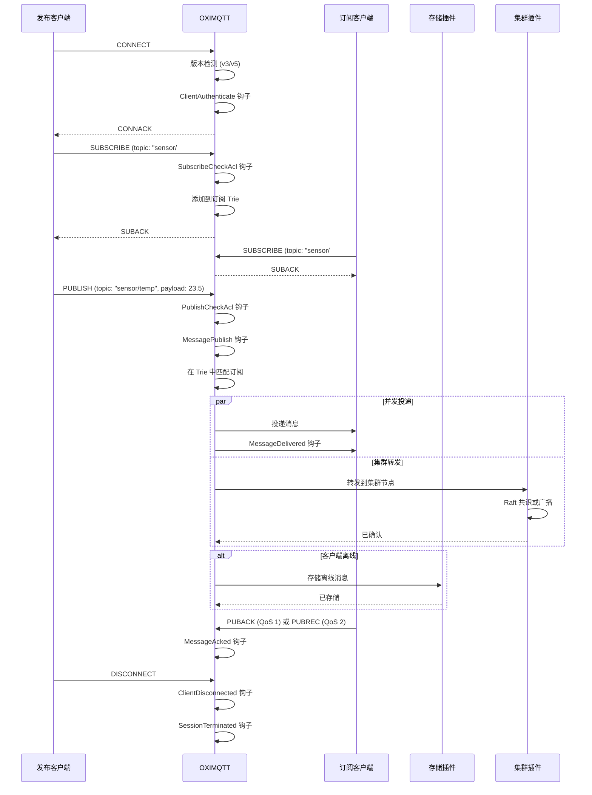
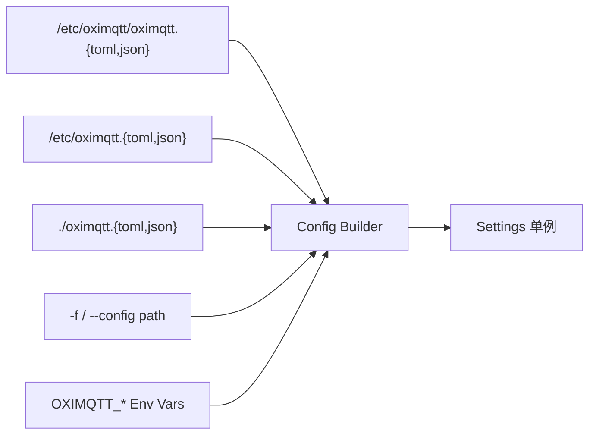

[English](../../en_US/architecture/overview.md) | [**简体中文**](overview.md)

# OXIMQTT 架构概览

本文档描述了 OXIMQTT MQTT Broker 的内部架构、组件组织、模块结构和关键设计决策。

---

## 系统架构



---

## Crate 组织

工作区分为以下层级：

### 第一层：基础 Crate

不依赖其他工作区 crate：

| Crate | 路径 | 职责 |
|-------|------|------|
| `oximqtt-utils` | `oximqtt-utils/` | 共享类型（`Bytesize`、`NodeAddr`、`Counter`）、serde 辅助、时间戳/间隔解析 |
| `oximqtt-macros` | `oximqtt-macros/` | 过程宏：`#[derive(Metrics)]` 原子计数器 |
| `oximqtt-codec` | `oximqtt-codec/` | MQTT 协议编解码 — v3.1、v3.1.1、v5.0 带版本协商 |

### 第二层：基础设施 Crate

基于基础 crate 构建：

| Crate | 路径 | 依赖 | 职责 |
|-------|------|------|------|
| `oximqtt-net` | `oximqtt-net/` | `oximqtt-codec`、`oximqtt-utils` | 网络层：TCP/TLS/WS/QUIC 监听器、连接接受、协议分发 |
| `oximqtt-conf` | `oximqtt-conf/` | `oximqtt-codec`、`oximqtt-net`、`oximqtt-utils`、`config` | 配置管理：TOML 解析、CLI 参数、监听器配置 |

### 第三层：核心 Broker

| Crate | 路径 | 依赖 | 职责 |
|-------|------|------|------|
| `oximqtt` | `oximqtt/` | 以上所有 + `oximqtt-net`、`oximqtt-codec`、`oximqtt-utils`、`oximqtt-macros`（可选）、`rust-box`、`dashmap`、`tokio` | 核心 MQTT Broker：会话管理、路由、钩子、内置模块、集群 |

### 第四层：二进制入口

| Crate | 路径 | 职责 |
|-------|------|------|
| `oximqttd` | `oximqtt-bin/` | 生产二进制：CLI 解析 → 配置 → 模块注册 → 服务启动 |
| `mqtt_harness` | `oximqtt-test/` | 测试框架：功能测试、压力测试、混沌测试 |

---

## 核心模块架构 (oximqtt/src/)

```
oximqtt/src/
├── lib.rs           # Crate 根，重新导出，模块声明
├── server.rs        # MqttServer — 构建器 + 接受循环 + 生命周期
├── context.rs       # ServerContext — 共享状态构建器
├── session.rs       # Session — 客户端状态机 (~2400 行)
├── v3.rs            # MQTT v3.1.1 协议处理器
├── v5.rs            # MQTT v5.0 协议处理器
├── router.rs        # 基于主题的消息路由
├── trie.rs          # 订阅匹配的 Trie 结构
├── topic.rs         # 主题过滤解析和验证
├── fitter.rs        # 主题过滤匹配引擎
├── inflight.rs      # 进行中消息追踪 (QoS 1/2)
├── queue.rs         # 带速率限制的消息队列
├── hook.rs          # 钩子系统 — 23 个扩展点
├── extend.rs        # 扩展点存储 (10 个 RwLock 插槽)
├── executor.rs      # 异步任务执行器包装
├── types.rs         # 核心数据类型 (~3000 行)
├── node.rs          # 集群节点协调，gRPC 服务
├── acl.rs           # ACL 类型和 trait 定义
├── args.rs          # 命令行参数结构体
├── shared.rs        # 共享订阅 ($share/)
├── delayed.rs       # [feature: delayed] 延迟发布
├── grpc.rs          # [feature: grpc] gRPC 通信
├── message.rs       # [feature: msgstore] 消息存储
├── metrics.rs       # [feature: metrics] 指标收集
├── retain.rs        # [feature: retain] 保留消息
├── stats.rs         # [feature: stats] 运行时统计
└── subscribe.rs     # [feature: *-subscription] 订阅辅助
```

---

## 会话生命周期



---

## 钩子系统

钩子系统是 OXIMQTT 的主要扩展机制，在消息处理管道的各个阶段提供了 **23 个拦截点**。

### Hook Trait

```rust
#[async_trait]
pub trait Handler: Send + Sync {
    async fn hook(&self, param: &Type, acc: Option<()>) -> ReturnType;
}
```

### 钩子类型

| 钩子类型 | 触发时机 | 处理器返回 |
|----------|----------|-----------|
| `BeforeStartup` | Broker 初始化 | Continue |
| `ClientConnect` | 收到 CONNECT | `(bool, Option<ConnAckReason>)` |
| `ClientAuthenticate` | 发送 CONNACK 前 | `(bool, Option<ConnAckReason>)` |
| `ClientConnack` | CONNACK 已发送 | Continue |
| `ClientConnected` | 会话已建立 | Continue |
| `ClientDisconnected` | 会话已结束 | Continue |
| `ClientSubscribe` | 收到 SUBSCRIBE | Continue |
| `ClientSubscribeCheckAcl` | 订阅 ACL 检查 | `(bool, Option<SubscribeAclResult>)` |
| `ClientKeepalive` | 保活超时或收到 ping | Continue |
| `ClientUnsubscribe` | 收到 UNSUBSCRIBE | Continue |
| `MessagePublish` | 收到 PUBLISH | `(bool, Option<MessagePublishResult>)` |
| `MessagePublishCheckAcl` | 发布 ACL 检查 | `(bool, Option<PublishAclResult>)` |
| `MessageDelivered` | 消息已发送给客户端 | Continue |
| `MessageAcked` | 客户端已确认 | Continue |
| `MessageDropped` | 消息被丢弃 | Continue |
| `MessageExpiryCheck` | 检查消息是否过期 | Continue |
| `MessageNonsubscribed` | 无匹配订阅者 | Continue |
| `SessionCreated` | 会话已创建 | Continue |
| `SessionTerminated` | 会话已销毁 | Continue |
| `SessionSubscribed` | 订阅已添加 | Continue |
| `SessionUnsubscribed` | 订阅已移除 | Continue |
| `OfflineMessage` | 离线消息已存储 | Continue |
| `OfflineInflightMessages` | 重连客户端加载 in-flight 消息 | Continue |
| `GrpcMessageReceived` | 跨节点 gRPC 消息 | `(bool, Option<Vec<u8>>)` |

### 钩子注册优先级

处理器可以注册时指定优先级。数值越小越先执行。`counter` 插件以 `Priority::MAX` 注册，确保它在最后执行。

---

## 内置模块

> **注意：** 插件系统已移除。原有的四个独立插件 crate（oximqtt-acl、oximqtt-auth-jwt、oximqtt-retainer、oximqtt-sys-topic）已合并到 `oximqtt` 核心 crate 中作为内置模块。它们直接在 `oximqtt.toml` 中通过各自的配置段（`[acl]`、`[auth_jwt]`、`[retainer]`、`[sys_topic]`）进行配置。`oximqtt-plugins/` 目录不再存在。

钩子系统仍可用于扩展 Broker 功能。内置模块在服务器初始化期间通过相同的钩子系统注册处理器。

---

## 消息流程



---

## 配置加载顺序



内置模块配置直接在 `oximqtt.toml` 中通过各自的配置段（如 `[acl]`、`[auth_jwt]`、`[retainer]`、`[sys_topic]`）进行设置。

---

## Feature 标志

核心 Broker（`oximqtt`）使用 Cargo feature 标志条件编译传输层：

| Feature | 启用内容 | 关键依赖 |
|---------|----------|----------|
| `default` | TLS + WebSocket + QUIC 传输 | — |
| `tls` | TLS 传输 | `oximqtt-net/tls` |
| `ws` | WebSocket 传输 | `oximqtt-net/ws` |
| `quic` | QUIC 传输 | `oximqtt-net/quic` |

其他所有功能（延迟发布、保留消息、指标统计、共享订阅、自动订阅等）均作为内置模块无条件编译。

---

## 关键设计决策

### 1. 零不安全代码

全项目强制 `#![deny(unsafe_code)]`。所有并发通过安全抽象（`tokio::sync`、`DashMap`、`Arc`）处理。

### 2. 锁策略

- **热路径**：`DashMap`（无锁并发 HashMap）用于订阅 Trie 和会话查找
- **异步上下文**：`tokio::sync::RwLock` 用于配置和共享状态（绝不在异步代码中使用 `std::sync::RwLock`）
- **细粒度**：`std::sync::Mutex` 仅用于小型同步临界区

### 3. 生产环境无 Panic

- `unwrap()` / `expect()` 仅出现在测试代码中
- 所有 `Result` 和 `Option` 通过 `?` 或模式匹配处理
- 生产路径中无 `panic!` / `todo!` / `unreachable!`

### 4. 模块隔离

每个内置模块（如 ACL、Retainer、Auth-JWT、Sys-Topic）作为核心 crate 的一部分进行编译，通过 Cargo feature 标志控制是否启用，确保未使用的功能零开销。

### 5. 编解码架构

MQTT 编解码使用状态机模式：
1. `VersionCodec` 从 CONNECT 数据包检测协议版本
2. 切换到 `v3::Codec` 或 `v5::Codec` 处理后续会话
3. 两者都实现 `tokio_util::codec::Encoder/Decoder` 以支持异步流

---

## 许可证

MIT OR Apache-2.0
